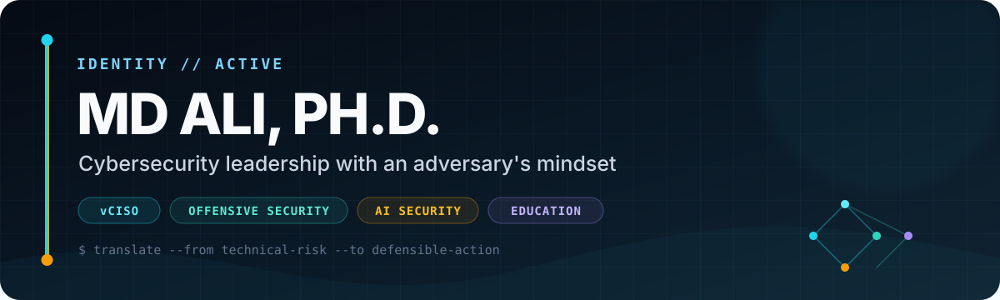

  

  
  
  
  

## I turn complex cyber risk into prioritized, defensible action.

I'm **Md Ali** — a **Virtual Chief Information Security Officer at [DOT Security](https://dotsecurity.com)** and **Cybersecurity Professor & Program Coordinator at [Olive-Harvey College](https://www.ccc.edu/colleges/olive-harvey/)**.

I work where executive risk decisions meet the attack surface. Across 10+ years in security, research, and education, I have connected cybersecurity strategy, governance, enterprise risk, offensive-security experience, and technical research to help organizations move from uncertainty to action.

My range is intentional: I can discuss risk with leaders, challenge assumptions like an attacker, work through systems at a low level, and teach the reasoning so others can repeat it.

| **Lead** | **Challenge** | **Enable** |
|:--|:--|:--|
| Cybersecurity strategy Governance & enterprise risk Incident readiness Executive communication | External, internal & web testing Vulnerability analysis Adversary-informed validation Technical-to-business translation | AI-security research Security automation Applied cybersecurity education Workforce development |

## Security operating model

| 01 · Discover | 02 · Prioritize | 03 · Validate | 04 · Enable |
|:--|:--|:--|:--|
| Establish the risk picture. | Turn exposure into decisions. | Challenge the assumptions. | Make resilience repeatable. |

> Strategy connected. Controls challenged. Teams enabled.

## Current focus

- **vCISO leadership** — security strategy, governance, enterprise risk management, regulatory readiness, roadmaps, and executive reporting
- **Adversary-informed assurance** — penetration testing, vulnerability analysis, security assessments, and practical remediation
- **AI security** — AI-driven threat detection, adversarial machine learning, agents, RAG, and security automation
- **Systems** — Linux, operating systems, distributed computing, virtualization, performance, and low-level security
- **Education** — ethical hacking, penetration testing, cybersecurity fundamentals, mentoring, and program development

## Selected work

| Project | What it explores |
|:--|:--|
| [**Linux Incident Response**](https://github.com/cyberprofali/Linux-Incident-Response) | A practical command reference for live response and forensics on Linux systems. |
| [**LamentOS**](https://github.com/cyberprofali/LamentOS) | A lightweight, Arch-based Linux distribution concept for penetration testers and security professionals. |
| [**Vulnerability Scanner**](https://github.com/cyberprofali/vulnerability-scanner) | An open-source experiment in accessible vulnerability-scanning workflows. |
| [**Rizal Center Ubuntu Setup**](https://github.com/cyberprofali/Rizal-Center-Ubuntu-Setup) | Automation for repurposing donated laptops into useful Ubuntu workstations for a community center. |

<a href="https://github.com/cyberprofali?tab=repositories">Browse all repositories →</a>

## Technical toolkit

**Leadership & assurance**

`NIST CSF` · `CMMC` · `HIPAA` · `PCI DSS` · `GRC` · `Security Risk Assessments` · `Incident Readiness` · `Penetration Testing`

**Systems, development & automation**

## Research & academic foundation

My research spans **AI and cybersecurity, adversarial machine learning, distributed systems, operating systems, program analysis, high-performance computing, quantum-circuit simulation, and computational physics**. At Argonne National Laboratory, I developed parallel optimization tooling in Julia for QTensor workflows on Polaris and Aurora.

| Degree | Institution | Year |
|:--|:--|:--:|
| Ph.D., Computer Science | Capitol Technology University | 2025 |
| M.S., Computer Science | Illinois Institute of Technology | 2022 |
| M.S., Applied Cybersecurity & Digital Forensics | Illinois Institute of Technology | 2020 |
| B.S., Physics & Applied Mathematics | Texas State University | 2019 |

**Selected peer-reviewed research**

- [Curvature Invariants for the Alcubierre and Natário Warp Drives](https://alihmd.com/publication/curvature-both/)
- [Curvature Invariants for the Accelerating Natário Warp Drive](https://alihmd.com/publication/natario-warp-drive/)
- [Curvature Invariants for Lorentzian Traversable Wormholes](https://alihmd.com/publication/lorentzian-traversable-wormholes/)

## Credentials & community

**PNPT** · **PJPT** · CISSP in progress

- Founder & Faculty Advisor, **Hacking Club — Olive-Harvey College**
- Speaker, **OWASP SnowFroc**
- Judge, **Global OSINT Search Party CTF**
- Mentor, **Women in CyberSecurity (WiCyS)**
- Volunteer Lead, **Rizal Filipino Community Center — Chicago**

## Let's connect

I'm always interested in thoughtful conversations about cybersecurity leadership, offensive security, AI security, systems, research, education, and open source.

  <a href="https://alihmd.com"><strong>Explore my work</strong></a>
  &nbsp;•&nbsp;
  <a href="https://www.linkedin.com/in/md-aliev"><strong>Connect on LinkedIn</strong></a>
  &nbsp;•&nbsp;
  <a href="mailto:mdhaliev@gmail.com"><strong>Start a conversation</strong></a>

---

<strong>Think deeply. Build securely. Hack elegantly.</strong>

